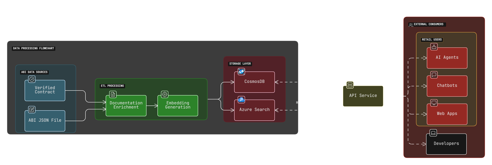
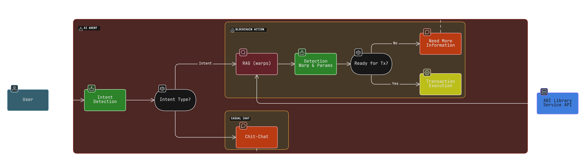

# MVX ABI Library

<p align="center">
  
</p>

<p align="center">
  A robust ABI library built with <a href="http://nestjs.com" target="_blank">NestJS</a> to serve external consumers.
</p>

## Overview

MVX ABI Library is designed to serve as a primary source for external consumers such as AI agents, chat-bots, and web apps. It processes ABI data sourced from verified contracts and JSON files, enriches them via ETL processes, and stores the results in scalable storage systems, making the data accessible through secure API endpoints.

## Features

- 🔍 Consolidates verified contract data and ABI JSON files.
- 🔧 Performs ETL processes including documentation enrichment and embedding generation.
- 🗄️ Stores enriched data in CosmosDB and Azure Search.
- ⚡ Optimized API service for high performance and scalability.
- 🔐 Secure endpoints following NestJS best practices.

## Architecture

Below is the architecture diagram representing the flow:


Here's an example of an agent using the API:


## Getting Started

### Prerequisites

- Node.js (v16 or later)
- npm or yarn
- Git

### Installation

1. Clone the repository

```bash
git clone https://github.com/mihaiLucian/mvx-abi-library-api.git
cd mvx-abi-library-api
```

2. Install dependencies

```bash
npm install
```

### Environment Setup

Create a `.env` file in the root directory with the necessary environment variables:

```
PORT=3000
NODE_ENV=development
# Add other required environment variables here
```

## Development

```bash
# Run in development mode with hot-reload
npm run start:dev

# Run in debug mode
npm run start:debug

# Run in production mode
npm run start:prod
```

## Testing

```bash
# Unit tests
npm run test

# E2E tests
npm run test:e2e

# Test coverage
npm run test:cov
```

## API Documentation

Once the server is running, you can access the API documentation at:

```
http://localhost:3000
```

## Project Structure

```
src/
├── config/           # Application configuration
├── modules/          # Feature modules
├── shared/           # Shared utilities and common code
├── app.module.ts     # Main application module
└── main.ts           # Application entry point
```

## Contributing

1. Fork the repository
2. Create a feature branch (`git checkout -b feature/amazing-feature`)
3. Commit your changes (`git commit -m 'Add some amazing feature'`)
4. Push to the branch (`git push origin feature/amazing-feature`)
5. Open a Pull Request

## License

This project is [MIT licensed](LICENSE).

## Acknowledgements

- Built with [NestJS](https://nestjs.com/)
- Powered by modern TypeScript
